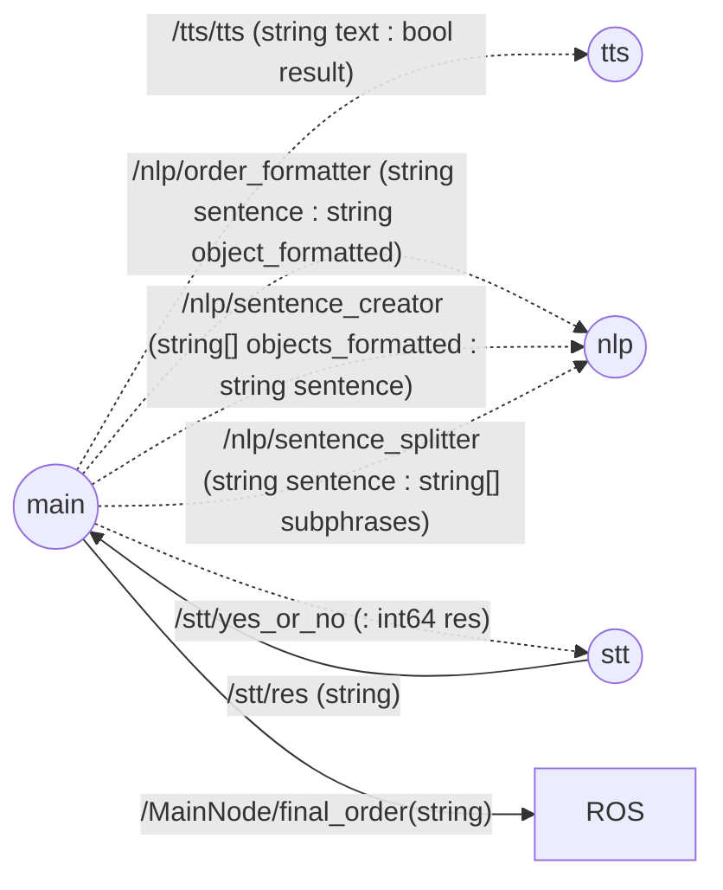
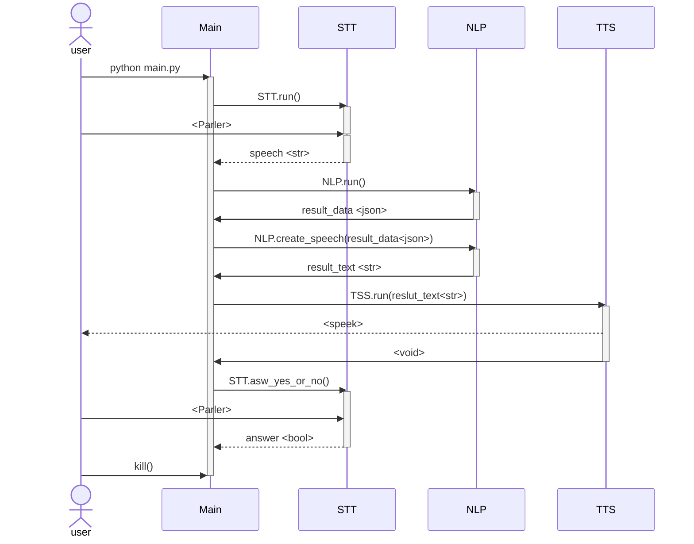

# Brique conversationnelle ROS2

### Navigation
[Noeud Speach To Text](./doc/stt/)  
[Noeud Natural Language Processing](./doc/nlp/)  
[Noeud Text To Speech](./doc/tts/) 


**Auteurs :** 
* Vincent BUNIAZET 
* Lucas COUDRAIS
* Alexis THOMAS


# Description
## Objectif global 

Le principe de ce projet est de mettre en place un système d'échange de message à l'oral entre une machine et un humain. L'humain doit pouvoir donner des ordres à la machine et la machine doit pouvoir analyser l'ordre et faire une demande explicite de confirmation à l'humain. Le tout doit être compatible avec un système ROS2 (Robot Operating System 2). De plus, le système complet doit permettre une discussion fluide et naturelle. 

### 1. Objectif détaillé 
Pour réaliser l'objectif, trois briques majeures doivent être mises en place :
* Une brique de parole à du texte (speech to text | STT)
* Une brique d'analyse d'un texte afin de déterminer les points majeurs utiles, soit un système d'analyse de langage naturel (Natural Language Processing | NLP)
* Une brique qui permet de transcrire du texte en parole (text to speech | TTS)

## 2. Les modules

### 2.1 [STT](./doc/stt/)  

Le principe de cette partie est de pouvoir :
* Ecouter le micro de la machine,
* Déclencher un record lorsque la machine entend un mot clé tel que "activer",
* Pouvoir retranscrire le discours au format texte (en direct ou en léger différé)
* Etre le plus fidèle possible à la réalité 
* Avoir un temps de calcul rapide
* Une exécution possible hors réseau

### 2.2 [NLP](./doc/nlp/) 

Le principe de cette partie est de pouvoir :
* Récupérer un texte (sous forme de chaine de caractère),
* Récupérer l'action associée, la pièce, les objets etc. demandé par l'utilisateur 
* Pouvoir paraphraser sous forme de texte en utilisant les mots clés identifiés, soit générer une nouvelle chaine de caractère avec les mots clés syntaxiquement compréhensibles par un humain
* Avoir un temps de calcul rapide
* Une exécution possible hors réseau
* Etre le plus fidèle possible à la réalité

### 2.3 [TTS](./doc/tts/)  

Le principe de cette partie est de pouvoir :

* Transmettre un message à l'aide de haut-parleurs
* Etre claire et compréhensible par un humain
* Avoir un temps de calcul rapide
* Une exécution possible hors réseau
* Pouvoir retranscrire un message sous forme de chaine de caractère en message audio


# Listes des fonctionnalités à mettre en place:

1. Documentation / Recherche / Etat de l'art / Choix technologiques
    1. [x] STT
    2. [x] TTS
    3. [x] NLP
2. Python
    1. [x] STT
    2. [x] TTS
    3. [x] NLP
    4. [x] Fusion des 3 (main)
3. Noeuds ROS
    1. [x] STT
    2. [x] TTS
    3. [x] NLP
    4. [x] Fusion des 3 (main)
4. Features
    1. STT
        1. [x] Déclenchement par mot clé
        3. [x] Mode d'écoute Oui/Non
        2. [ ] Déclenchement par phrase type et pas par mot clé unique (avec une interaction continue avec le NLP)
        3. [ ] Amélioration possible : Rajouter un signal sonore quand le robot est en écoute et a fini d'écouter
    2. TTS
        1. [x] Solution online 
        2. [x] Solution offline 
        3. [x] Gestion de fallback => Benchmark automatique => choix de solution online ou offline
        4. [x] Fonctionnement sur Cuda 
        5. [x] Amélioration possible : Voix masculine 
        6. [ ] Amélioration possible : Benchmark/Essais Jetson
    3. NLP 
        1. [x] Analyse syntaxique de la phrase pour récupérer les éléments essentiels aux ordres du GPSR
        2. [x] Reformulation de la phrase
        3. [ ] Amélioration possible : Intelligence de savoir ce qui ne va pas dans la phrase donnée si on lui restreint le champ des possibles
        4. [ ] Amélioration possible : Optimiser/Améliorer l'intelligence de la reformulation

# Représentation des noeuds



# Description de l'algo



# Vidéos de présentation

[Lien vers la playlist youtube](https://www.youtube.com/playlist?list=PLExHHlVbyZd-jNUhjAmd78lIOltjA32z5 )

[Lien vers la vidéo pitch youtube](https://youtu.be/1M41ZEsX_30)

[Lien vers la vidéo tutoriel youtube](https://youtu.be/BhfYEOudpCE)

[Lien vers la vidéo démo youtube](https://youtu.be/Mzyzo0LUCUc)

# Liste des dépendances et pré-requis

- 3.9.0 <= Python version <= 3.11
- ROS2 Humble

Réaliser ces commandes pour préparer l'environnement :

```cmd
sudo apt install espeak
sudo apt-get install ffmpeg
python3 -m venv venv
source venv/bin/activate
```

Pour installer toutes les dépendances et build les noeud ros
```
pip install -r requirements.txt 
```
Pour installer les dépendances pour lancer des briques python indépendamment
```
pip install -r ./src/nlp/requirements.txt
pip install -r ./src/stt/requirements.txt
pip install -r ./src/tts/requirements.txt
```
# Procédure de mise en route

- Installez les librairies et dépendances comme défini plus haut.

- Télécharger le modèle pour le STT au préalable
```cmd
python3 src/stt/stt/download_model.py 
```

- Sourcez ROS2 si ce n'est pas déjà fait
- Build des différents packages :
```cmd
colcon build --packages-select interfaces_services main nlp tts stt
```

- Pour run les différents noeuds, ouvrez d'autres terminaux, et lancez ces commandes (un node par terminal)
```cmd
source <emplacementROS2Humble>
cd <workspace>
source install/local_setup.bash

ros2 run nlp nlp

ros2 run tts tts

ros2 run main main

ros2 run stt stt

```

- Une autre possibilité est d'utiliser le roslaunch en ouvrant un autre terminal et en lançant ces commandes :
```cmd
source <emplacementROS2Humble>
cd <workspace>
source install/local_setup.bash
cd launch
ros2 launch brique_discution_launch
```
