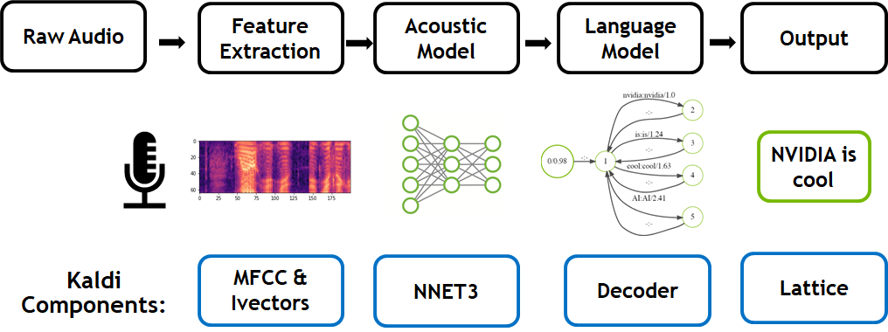
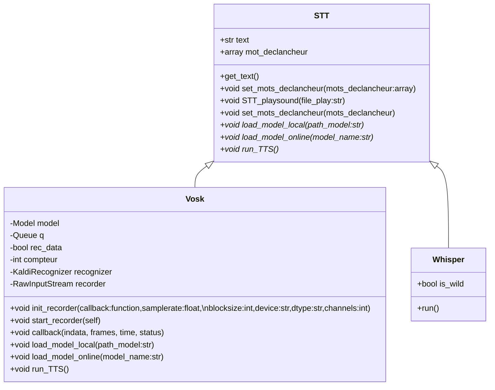

# Module de conversion de la parole au texte (STT)

### Navigation
[HOME](https://gitlab.com/cpelyon/rob/5irc-2023-2024/projets/Sujet_2_Brique_Conversationnelle/S2_G2_Buniazet_Coudrais_Thomas/)  
[NLP](../nlp/)  
[TTS](../tts/) 

**Auteurs :** 
* Vincent BUNIAZET 
* Lucas COUDRAIS
* Alexis THOMAS

- [Module de conversion de la parole au texte (STT)](#module-de-conversion-de-la-parole-au-texte-stt)
    - [Navigation](#navigation)
  - [Description](#description)
  - [Etat de l'art](#etat-de-lart)
    - [Tests](#tests)
    - [Analyse](#analyse)
    - [Conclusion](#conclusion)
  - [Solution choisie](#solution-choisie)
  - [Utilisation utilisateur final](#utilisation-utilisateur-final)
  - [Utilisation développeur :](#utilisation-développeur-)
    - [Dépendances](#dépendances)
  - [Sources et Annexes](#sources-et-annexes)
  - [Architecture](#architecture)

## Description

Le principe de ce module est de retranscrire une parole "orale" en un texte utilisable par différents algorithmes.


## Etat de l'art

Différentes solutions avaient été avancées, telles que deepspech qui a été arrêté pour passer à coquiTTS, lui aussi a été abandonné pour Whisper. 

### Tests

| Test | Solution | Texte original | Audio | Texte détecté | Temps d'exécution | Modèle |
|:---:|:---:|:---:|:---:|:---:|:---:|:---:|
| 1 | Whisper | [ici](https://www.lemonde.fr/economie/article/2023/11/29/l-intelligence-artificielle-menace-de-nombreux-metiers-notamment-les-emplois-administratifs-et-de-bureau-ou-les-services-comptables_6203024_3234.html) | [ici](test/fichier_audio_input/input_60.wav) | J'aimerais n'attends autant par les d'intelligence artificielle génératives depuis le 17 novembre le sort de Sam Altman, l'homme à la tête de la société qui a créé le logiciel Chateau-PT capable d'élaborer des textes en langues naturelles selon la recette formulée par l'utilisateur, à alimenter sans discontinuer la chronique. Pas seulement parce qu'était alors débarqué, provisamment le patron du start-up valorisé après le 90 milliards de dollars, 42 milliards d'euros, mais aussi parce que les outils qu'elles développent à même de rédigir une dissertation à la place d'un étudiant, un scénario à la place de scénariste au conseillet un assuré à la place d'un interlocuteur humain, semble pouvoir changer la trajectoire de l'économie mondiale. Pas plus tard que le 2 novembre est le même investi de la première heure d'open AI, la société de Sam Altman estime. | ```8.577589988708496``` | tiny |
| 1 | Vosk | [ici](https://www.lemonde.fr/economie/article/2023/11/29/l-intelligence-artificielle-menace-de-nombreux-metiers-notamment-les-emplois-administratifs-et-de-bureau-ou-les-services-comptables_6203024_3234.html) | [ici](test/fichier_audio_input/input_60.wav) | j'amène ton autant parler d'intelligence artificielle générateur depuis le dix-sept novembre le sort de sam altman l'homme à la tête de la société qui a écrit le logiciel dieppe été capable d'élaborer des textes en langage naturel selon la requête formulée par l'utilisateur à alimenter sans discontinuité la chronique pas seulement parce qu était alors débarquer provisoirement le patron d'une start-up valoriser à près de quatre vingt dix milliards de dollars quatre un deux milliard d'euros mais aussi parce que les outils qu'elle développe à même de rédiger une dissertation à la place d'un étudiant un scénario à la place d'un scénariste au conseiller un assuré à la place un interlocuteur humain semble pouvoir changer la trajectoire de l'économie mondiale pas plus tard que le deux novembre elon musk lui-même investi de la première heure d'open à la société de sam altman estimé. | ```9.6168212890625``` | vosk-model-small-fr-0.22 |
| 2 | Whisper | [ici](https://geekflare.com/fr/speech-to-text-solutions/) | [ici](test/fichier_audio_input/input_mic_tel_3.wav) | Les solutions de Sam Tese, reclète de Vient Pofulaire en particulier après l'aventant des savices de recherche du vocat de Malexe. Ces solutions apportent ce plus déficé cité aux particuliers, aux entreprises. En fait, c'est l'écriture et une tâche essencienne que chacun doit taquet via dans sa carrière professionnelle. Ou ce soit la réaction d'un email, une galartine de blog, une vulte d'un et des rodements pour préparer des présentations documentés des idées, prendre des notes etc. Même si vous tapez plus vite, ça lui déce reste inférieur à la vitesse lorsque vous parlez. Le fait est que l'écriture physique est bien plus l'empue de l'empue que la vitesse de traitement réel de votre cerveau. Cela signifie qu'il est possible d'autométisation illée possible de taper avec votre povoie sans impiquer vos mains. Oui, c'est vrai et cette technologie est un logiciel speech to texte. | ```7.386072397232056``` | tiny |
| 2 | Vosk | [ici](https://geekflare.com/fr/speech-to-text-solutions/) | [ici](test/fichier_audio_input/input_mic_tel_3.wav) | les solutions de synthèse vocale devient populaire en particulier après avec des services de recherche vocale comme alexa ces solutions apporte plus d'efficacité aux particuliers et entreprises en fait l'écriture est une tâche essentielle que chacun doit accomplir dans sa carrière professionnelle ce soit la rédaction d'un email un article de blog bulletins et des romans pour préparer des présentations documenté des idées prendre des notes etc même si vous tapez plus vite cette vitesse reste inférieur à la vitesse lorsque vous parlez le fait est que l'écriture physique et bien plus lente que la vitesse de traitement réel de notre cerveau cela signifie qu'il est possible d'économiser le temps consacré à la saisie a l'air de l'automatisation il est possible de taper avec votre voix sans impliquer vos mains oui c'est vrai et cette technologie est un logiciel spitz tout texte | ```14.818839311599731``` | vosk-model-small-fr-0.22 |

### Analyse 

**Whisper :** C'est une solution développée par OpenAI, elle permet de faire un speech to text. Sur un speech de 60 minutes, elle met environ 10 secondes avec des performances de base *(cf. développement ci-dessus)*. 

Elle dispose de différents modèles de différentes tailles, plus le modèle est gros, plus le temps de l'instanciation est long. Il est plus intéressant pour notre projet d'utiliser un modèle plus léger afin d'avoir le temps de réponse le plus court possible, afin de répondre le plus rapidement possible à l'utilisateur. Le temps de Whisper n'évolue pas selon l'environnement, pour un temps d'audio donné, il met toujours le même temps mais plus il y a de bruit de fond, plus il fait d'approximations, cela nous fait perdre des informations potentiellement importantes. Whisper propose plusieurs modèles [ici](https://github.com/openai/whisper/blob/main/model-card.md). 

Plus on utilise un modèle lourd, plus le temps de calul est important mais la précision augmente. 

**NB :** Pour chaque modèle, le temps de calcul ne dépends pas du bruit de fond mais seulement du temps de l'audio. (les modèles trop grands font crash certains PC sans GPU)

Exemple code de test :  ```python test/test_whisper.py test/fichier_audio_input/input_60.wav```


**Vosk :** C'est une solution développée par alphacephe, elle permet de faire un speech to text. Sur un speech de 60 minutes, elle met environ 10 secondes avec des performances de base *(cf. développement ci-dessus)*. 

Elle propose différents modèles dans différents langages [ici](https://alphacephei.com/vosk/models). Pour notre projet, nous aurons la possibilité d'utiliser deux modèles, une version anglaise et une française. Cela nous permet de mettre en place deux versions du STT facilement et rapidement. Dans les deux cas, nous prendre une version allégée afin que l'instance soit la plus rapide possible. 

Vosk est basé sous Kaldi optimisé par Nvidia. Plus il y a de bruit de fond, plus le temps d'exécution de la reconnaissance est longue, mais le texte reste assez précis même s'il y a du fond sonore, il arrive à "capter" le discours et les idées principales assez facilement. Même dans des conditions très difficiles, il arrive à capter quelques mots et il met en moyenne (pour une minute de discours) environ 1min de décodage. Vosk propose un large choix de modèle dans différentes langues [ici](https://alphacephei.com/vosk/models). 

Exemple code de test :  ```python test/test_vock.py fichier_audio_input/input_60.wav```



**Whisper cpp:** Whisper cpp est une version améliorer de whisper, elle est optimiser et plus rapide que whisper classique et permet une meilleur reconnaissance audio. Tout comme whisper, elle dispose de différentes tailles de modèles disponible en ligne au format ggml ".bin" 

[model](https://huggingface.co/ggerganov/whisper.cpp/tree/main)

**NB :** Pour pouvoir utiliser cette version de whisper, il faut compiler de façon à générer un .so qui, est utiliser par python.


### Conclusion

Après de multiples recherches, les deux librairies de STT disponibles en offline en open source sont les deux citées ci-dessus. Les autres variantes présentes ne sont plus supportées et/ou plus développées et donc devenues obsolètes, ou en ligne *(exemple de pvcheetah)*. Il n'y a pas vraiment de différence notable entre les deux que ce soit en temps ou en précision bien que whisper a tendance à mieux s'en sortir avec de gros modèles en milieux bruyants, mais devient systématiquement plus lent contrairement à vosk qui reste plus rapide lorsqu'il n'y a pas trop de bruit et on obtient une précision (_sur les tests réalisés ci-dessus_) correcte dans la plupart des cas. 

## Solution choisie 

Au vue des différents test, vosk semblais une bonne solution simple et rapide d'utilisation mais les tests en anglais sont très aproximatif et fonctionne très mal mais il fonctionne très bien pour du français. Pour ce qui est du whisper, la version cpp est plus optimiser mais plus difficile à mettre en place, mais à la vue des différents test, whisper cpp semble le plus approprier pour ce genre de problème

## Utilisation utilisateur final

Pour le choix retenu : 

Préparer l'environnement de lancement:
```cmd
pip install -r ./src/stt/requirements.txt
```

Télécharger le modèle : 
```cmd
cd doc
python3 stt/package_STT/download_model.py
```

Lancer la démo python : 
```cmd
python3 stt/package_STT/STT_Whisper_cpp.py
```

## Utilisation développeur :

=> Le fichier présent dans doc/stt/package_STT/*.py peuvent être éditer, dans le fichier ```STT_Whisper_cpp.py``` sont présent tout les paramètres disponible pour whisper CPP (voir readme [ici](https://github.com/ggerganov/whisper.cpp/tree/master))

=> Le fichier : ```stream.cpp``` [ici](test/whisper.cpp-master/examples/stream/stream.cpp) et ```stream.h``` [la](test/whisper.cpp-master/examples/stream/stream.h)

peuvent être modifier, toute la logique de calcul se trouve dans se fichier la avec l'utilisation de whisper les autres fichier présent dans ```test/whisper.cpp-master``` font partie de la librairie whisper cpp (il est déconseiller de modifier ces fichiers là)

=> Suite à la modification de stream.cpp et/ou stream.h : 
1. faire un make dans le dossier ```whisper.cpp-master```
2. Copier coller le fichier ```libstream.so``` dans le dossier ```package_STT``` 

**NB :** En cas de modification d'un fichiers ci-dessus il est important de copier coller le fichier ```libstream.so``` dans le dossier ```src/stt/lib``` en écrasant l'ancien si vous souhaitez utiliser vos modifications sous ROS2 

### Dépendances 

Vous pouvez utiliser cette commande :

```
pip install -r requirements.txt
```

Sinon, pour chaque librairie :

vosk : 

```
pip install sounddevice
pip install vosk
pip install playsound
```


whisper : 

```
pip install sounddevice
pip install numpy
pip install SpeechRecognition
pip install torch
pip install git+https://github.com/openai/whisper.git
pip install playsound

```

whisper cpp :

Les fichiers source de whisper cpp peuvent être modifier est adapter mais il est important d ``` build ``` à chaque modification et de bien lancer correctement le python avec la librairie appropier générer par le make (````libstream.so``)


## Sources et Annexes

* Whisper : https://github.com/openai/whisper

* Vosk : https://alphacephei.com/vosk/

* https://github.com/davabase/whisper_real_time/blob/master/transcribe_demo.py, duaneking, 24 novembre 2023
* https://github.com/alphacep/vosk-api/blob/master/python/example/test_microphone.py, edwin-hendriks, 7 décembre 2022

* Différents tests sons disponibles dans ```fichier_audio_input/``` avec :

    * (1 min)(fr) input_mic_tel : un son clair d'un discours avec peu de bruit de fond
    * (1 min)(fr) input_mic_tel_2 : un son d'un discours avec beaucoup de bruit de fond *(le discours est difficilement audible)*
    * (1 min)(fr) input_mic_tel_3 : un son d'un discours avec un peu de bruit de fond
    * (1 min)(fr) input_60 : un discours sans bruit de fond 
    * (1 min)(en) english_test : une personne qui parle en anglais (un podcast)
    * (10s)(fr) inpout : une personne qui parle

## Architecture

