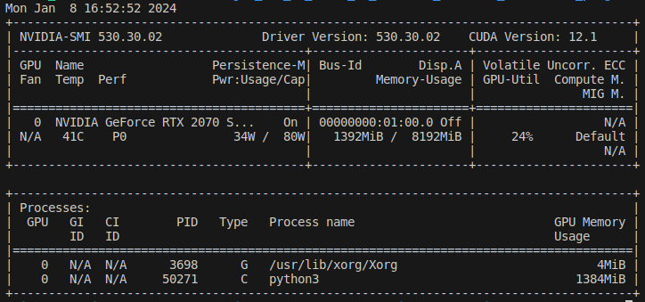
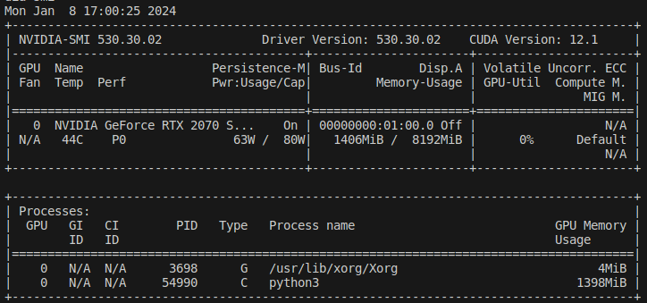

# Module de conversion du texte à la parole (TTS)

### Navigation
[HOME](https://github.com/Sylfiooo/Brique-Conversationnelle-Robocup)  
[STT](../stt/)  
[NLP](../nlp/)   

**Auteurs :**

* Vincent BUNIAZET
* Lucas COUDRAIS
* Alexis THOMAS

### Sommaire

  - [Description](#description)
  - [Etat de l'art](#etat-de-lart)
    - [Différents types de TTS](#différents-types-de-tts)
    - [Points clés](#points-clés)
    - [Liste des technologies (non exhaustive)](#liste-des-technologies-non-exhaustive)
    - [Conclusion](#conclusion)
  - [Voix masculine](#voix-masculine)
  - [Lecture en flux](#lecture-en-flux)
  - [Benchmark](#benchmark)
    - [Sur le CPU d'un Triton](#sur-le-cpu-dun-triton)
    - [Sur le GPU d'un Triton](#sur-le-gpu-dun-triton)
  - [Décision finale](#décision-finale)
    - [Modèle d'IA](#modèle-dia-1)
    - [TTS API](#tts-api)
  - [Gestion de FallBack](#gestion-de-fallback)
    - [Benchmark automatique](#benchmark-automatique)
  - [Code python](#code-python)
  - [Noeud ROS](#noeud-ros)
  - [Possibilités d'améliorations](#possibilités-daméliorations)
  - [Sources annexes](#sources-annexes)

## Description 

Le principe de ce module est de retranscrire un texte écrit en une voix qui le lit.

## Etat de l'art

- Retranscrire un texte en audio qui contient une imitation d'une voix qui lirait le texte.  

- Ambition : retranscription compréhensible en un temps minimal

- TTS recherché (pourquoi pas cloud aussi si mise en place de fallback) :
  - Fonctionne en local
  - Rapide et léger
  - Compréhensible

### Différents types de TTS
2 grandes caractéristiques de distinction d'un TTS :
- Synthétiseur Vocal
- Intelligence Artificielle 

#### Caractéristiques 
- Temps d'inférence, de génération de l'audio
- Compréhension de l'audio
- Voix, genre de la voix
- Vitesse de parole
- Qualité de l'audio
- Expression des émotions, ponctuations
- Choix de la langue, de l'accent

#### Synthétiseur vocal
- Transforme un texte en une suite de phonème qui forme une retranscription de ce texte 
- Chacun propose ses propres phonèmes avec leur prononciation 
  - Caractéristiques dépendent directement du synthétiseur  
- Souvent utilisé par des systèmes pour l'audiodescription instantané.
  - Librairies python sont souvent un simple interface des [synthétiseur vocaux linux](https://doc.ubuntu-fr.org/synthese_vocale)
  - Librairie pas tant nécessaires => taper des lignes de commande en python  
- Temps d'inférence imbattable => 0.1 sec
- Compréhension parfois problématique, voix souvent typé robotique

#### Intelligence Artificielle
- Un modèle d'IA retranscrit un texte en une prononciation de ce texte
- Multitude de spécialisation pour un modèle 
  - Rapidité, minimisation de temps d'inférence
  - Clonage de timbre de voix ou de voix complète 
  - Imitation de voix humaine, émotions
  - Demande des ressources plus ou moins conséquentes
  - ...
- Multitude de modèle pré-entrainé à disposition.  
- Librairie python pour exploiter ces modèles => plus ou moins optimisé pour différents usages.
  - Proposent des modèles pré-entrainé directement intégré
  - Possibilité d'importer des modèles externes
  - Caractéristiques dépendent essentiellement du modèle et pas de la librairie  
- Temps d'inférence => difficilement en dessous de 0.5 secondes
- Bonne compréhension => voix typé plus humaine que robotique

#### Online
- Modèle d'IA hébergé sur des machines puissantes dans le cloud
- Rapport qualité de compréhension / temps d'inférence imbattable
- Temps d'inférence => 1 sec (temps de la requête)
- Nous intéresse que dans un fonctionnement optimal => optionnel

#### Offline
- Synthétiseur vocal ou IA 
- Performances dépendent de la machine
- Permet d'être disponible de partout, de la même manière

### Points clés

#### Phonème
- Représente la prononciation d'une syllabe, d'une lettre, d'un suivi de mot
- Exemple : pour retranscrire "bonjour" => Concaténation des phonème de "bon" + "jour" 

#### Temps d'inférence
- Temps de génération de l'audio pour un texte donné
- Utilisation de type "discours" => temps d'inférence court

#### Compréhension
- Audio compréhensible et interprétable pour un humain
- Voix typé "humaine" et non robotique est un plus 

#### Cas spécifiques
- Anglicisme en Français
- Ponctuation
- Chiffre  
- ...

#### Mode de lecture 
- Lecture de l'audio dans un fichier
- Lecture de l'audio en flux direct
- Ligne de commande 
- Interface et code python

#### Langues, voix, genre, qualité, émotions...
- Caractéristique intéressante de différentes solution TTS, chacune a ses spécifictiés
- Toutes nous intéresse, il faut peser le pour et le contre de chacune 

#### Communauté, popularité, récente...
- Critère important pour choisir une technologie TTS

### Liste des technologies (non exhaustive)

| librairie | disponibilité | type | temps d'inférence (pour une phrase) | compréhension | mode de lecture | fonctionnalités | remarque
|:---:|:---:|:---:|:---:|:---:|:---|:---|:---|
| [gTTS](#gtts) | online | IA | environ 1 sec (temps requête l'API) | très bonne | fichier   flux   librarie python et interfacage | 1 seule voix féminine   plusieurs langues et accents  quelques émotions   gère les anglicismes  les chiffres   la ponctuation | TTS de google translate   techniquement très simple   dis tous parfaitement
| [coquiTTS](#coquitts) | offline | IA | dépend du modèle | dépend du modèle | fichier   flux   librairie python et interfacage | énormément de modèle préentrainé à disposition   possibilité d'entrainer des modèles avec des extraits de voix simplement | Solution de TTS python numéro 1   Complexité technique  complet, alambiqué   démo des modèles pratiques
| [pyttsx3](#pyttsx3-espeak) | offline | synthétiseur vocal (esepak, sapi5, nsss) | très court   0.1 sec | dépend du synthétiseur   espeak => très mauvaise, très typé robotique, parfois incompréhensible | fichier   flux   librarie python et interfacage | controle de la vitesse   le volume   la voix |  simple interfaçage python de différents synthétiseur vocaux
| [piper](#piper) | offline | IA | dépend du modèle | dépend du modèle | fichier   flux   librairie python | choix de la langue   la voix   la qualité | léger et simple   utilisation de modèle onnx simple   adapté pour raspberry 4 
| [mimic3](#mimic3) | offline | IA | dépend du modèle | dépend du modèle | fichier   flux   librairie python | très customizable   choix de langue   de qualité de l'audio etc | semble dépassé   peu optimisé pour les performances
| [picotts](#picotts-svoxpico) | offline | synthétiseur vocal => svoxpico | court   environ 0.3 secondes| satifaisante | fichier   flux   librarie python et interfacage | Seulement 5 langue et une voix | synthétiseur vocal d'android   considéré comme le meilleur   très rapide pour voir la qualité et la compréhension du rendu
| [voxpopuli](#voxpopuli-mbrola) | offline | synthétiseur vocal => mbrola | très court   0.15 secondes | mauvaise (entre espeak et svox) | fichier   flux   librairie python et interfacage | plusieurs langues   plusieurs voix   possibilité de choisir la rapidité et le pitch. | plusieurs publicateur pour les voix notamment babel qui semble fiable   meilleur alternative a picotts pour avoir d'autres voix.

  
Autres

Il existe également d'autre outils assez intéressant et performant qu'on ne développera pas :
- [OpenAi TTS](https://platform.openai.com/docs/guides/text-to-speech) 
- - API online, il faut une clé, surement payante.
- - TTS online très performant et assez semblable a un language humain 
- - Surement aussi rapide que gTTS car hebergé chez OpenAI
- [TensorFlowTTS](https://github.com/TensorSpeech/TensorFlowTTS) 
- - Semble assez semblable a coquiTTS
- - Semble y avoir peu de doc et de communauté
- - Performances et rendu semblables a coquiTTS [(voir démo)](https://tensorspeech.github.io/TensorFlowTTS/) 
- [Larynx](https://github.com/rhasspy/larynx) 
- - Offline, IA
- - Semble être assez customisable, ce qui peut le rendre assez rapide [(voir vidéo)](https://www.youtube.com/watch?v=hBmhDf8cl0k) 
- - Semble être bien documenté et fonctionnel mais il aurait un sucésseur plus dapdté, [Piper](https://rhasspy.github.io/piper-samples/), qu'on étudiera à la palce

#### gTTS

[Doc](https://gtts.readthedocs.io/en/latest/)  
[32M de dl sur pepy.org](https://www.pepy.tech/projects/gtts)  
[Code de test](./archive_test/gTTS/gTTS.py)  

`Hello, my name is Lucas Coudrais, I am 22 years old, I am a robotics student, and I want to eat burgers in Lyon.`

[Audio de résultat du TTS](./archive_test/gTTS/gTTS.mp3)  

<audio controls>
  <source src="./archive_test/gTTS/gTTS.mp3">
</audio>  
 

`Bonjour, je m'appelle Lucas Coudrais, j'ai 22 ans, je suis étudiant en robotique et je veux manger des burgers à Lyon.`

[Audio de résultat du TTS](./archive_test/gTTS/gTTS_fr.mp3)  

<audio controls>
  <source src="./archive_test/gTTS/gTTS_fr.mp3">
</audio>   

#### coquiTTS
[Doc](https://tts.readthedocs.io/en/latest/inference.html)  
[23.3k stars sur github](https://github.com/coqui-ai/TTS)  
[Liste des modèles de coquiTTS](./archive_test/coquiTTS/list-model.txt)  
[Code de test](./archive_test/coquiTTS/coquiTTS.py)  

`Hello, my name is Lucas Coudrais, I am 22 years old, I am a robotics student, and I want to eat burgers in Lyon.`

[Audio de résultat du TTS](./archive_test/coquiTTS/coquiTTS.wav)

<audio controls>
  <source src="./archive_test/coquiTTS/coquiTTS.wav">
</audio>

`Bonjour, je m'appelle Lucas Coudrais, j'ai 22 ans, je suis étudiant en robotique et je veux manger des burgers à Lyon.`

[Audio de résultat du TTS](./archive_test/coquiTTS/coquiTTS_fr.wav)

<audio controls>
  <source src="./archive_test/coquiTTS/coquiTTS_fr.wav">
</audio>

#### pyttsx3 (espeak)
[Doc](https://github.com/nateshmbhat/pyttsx3)  
[4M de dl sur pepy.org](https://www.pepy.tech/projects/pyttsx3)   
[Code de test](./archive_test/pyttsx3/app.py)  

`Hello, my name is Lucas Coudrais, I am 22 years old, I am a robotics student, and I want to eat burgers in Lyon.`

[Audio de résultat du TTS](./archive_test/pyttsx3/pyttsx3.mp3)  

<audio controls>
  <source src="./archive_test/pyttsx3/pyttsx3.mp3">
</audio>

`Bonjour, je m'appelle Lucas Coudrais, j'ai 22 ans, je suis étudiant en robotique et je veux manger des burgers à Lyon.`

[Audio de résultat du TTS](./archive_test/pyttsx3/pyttsx3_fr.mp3)  

<audio controls>
  <source src="./archive_test/pyttsx3/pyttsx3_fr.mp3">
</audio>

#### Piper
[Doc](https://github.com/rhasspy/piper#running-in-python)  
[2k stars sur github](https://github.com/rhasspy/piper)   
[Démo](https://rhasspy.github.io/piper-samples/)   
[Modèles à disposition](https://huggingface.co/rhasspy/piper-voices/tree/v1.0.0)  
[Code de test](./archive_test/piper/piper.py)  

`Hello, my name is Lucas Coudrais, I am 22 years old, I am a robotics student, and I want to eat burgers in Lyon.`

[Audio de résultat du TTS](./archive_test/piper/piper.wav)  

<audio controls>
  <source src="./archive_test/piper/piper.wav">
</audio>

`Bonjour, je m'appelle Lucas Coudrais, j'ai 22 ans, je suis étudiant en robotique et je veux manger des burgers à Lyon.`

[Audio de résultat du TTS](./archive_test/piper/piper_fr.wav)  

<audio controls>
  <source src="./archive_test/piper/piper_fr.wav">
</audio> 

#### mimic3
[Doc](https://mycroft-ai.gitbook.io/docs/mycroft-technologies/mimic-tts/mimic-3#installation)  
[865 stars sur github](https://github.com/MycroftAI/mimic3)   
[Code de test](./test/mimic3/mimic3.py)  
[Démo](https://mycroftai.github.io/mimic3-voices/)  
[Liste des voix](https://github.com/MycroftAI/mimic3-voices)  

`Hello, my name is Lucas Coudrais, I am 22 years old, I am a robotics student, and I want to eat burgers in Lyon.`

[Audio de résultat du TTS](./archive_test/mimic3/mimic3.wav)  

<audio controls>
  <source src="./archive_test/mimic3/mimic3.wav">
</audio>

`Bonjour, je m'appelle Lucas Coudrais, j'ai 22 ans, je suis étudiant en robotique et je veux manger des burgers à Lyon.`

[Audio de résultat du TTS](./archive_test/mimic3/mimic3_fr.wav)  

<audio controls>
  <source src="./archive_test/mimic3/mimic3_fr.wav">
</audio>

#### picotts (svoxpico)
[Doc](https://pypi.org/project/py-picotts/)  
[127 stars sur github](https://github.com/ihuguet/picotts)   
[Code de test](./archive_test/picotts/app.py)  
[Se base un synthétiseur vocal](https://doc.ubuntu-fr.org/svoxpico)  

`Hello, my name is Lucas Coudrais, I am 22 years old, I am a robotics student, and I want to eat burgers in Lyon.`

[Audio de résultat du TTS](./archive_test/picotts/pico.wav)  

<audio controls>
  <source src="./archive_test/picotts/pico.wav">
</audio>

`Bonjour, je m'appelle Lucas Coudrais, j'ai 22 ans, je suis étudiant en robotique et je veux manger des burgers à Lyon.`

[Audio de résultat du TTS](./archive_test/picotts/pico_fr.wav)  

<audio controls>
  <source src="./archive_test/picotts/pico_fr.wav">
</audio> 

`Voulez vous que j\'aille chercher des bananes dans le frigo de la cuisine ?`

[Audio de résultat du TTS](./archive_test/picotts/pico_question_fr.wav)  

<audio controls>
  <source src="./archive_test/picotts/pico_question_fr.wav">
</audio>

#### voxpopuli (mbrola)
[Doc](https://pypi.org/project/voxpopuli/)  
[26 stars sur github](https://github.com/hadware/voxpopuli)   
[Code de test](./archive_test/mbrola/mbrola.py)  
[Se base un synthétiseur vocal](https://github.com/numediart/MBROLA)  
[Liste des voix](https://github.com/numediart/MBROLA-voices)  

`Hello, my name is Lucas Coudrais, I am 22 years old, I am a robotics student, and I want to eat burgers in Lyon.`

[Audio de résultat du TTS](./archive_test/mbrola/mbrola.wav)  

<audio controls>
  <source src="./archive_test/mbrola/mbrola.wav">
</audio> 

`Bonjour, je m'appelle Lucas Coudrais, j'ai 22 ans, je suis étudiant en robotique et je veux manger des burgers à Lyon.`

[Audio de résultat du TTS](./archive_test/mbrola/mbrola_fr.wav)  

<audio controls>
  <source src="./archive_test/mbrola/mbrola_fr.wav">
</audio>

`Voulez vous que j\'aille chercher des bananes dans le frigo de la cuisine ?`

[Audio de résultat du TTS](./archive_test/mbrola/mbrola_question.wav)  

<audio controls>
  <source src="./archive_test/mbrola/mbrola_question.wav">
</audio>

### Conclusion
Dans l'idéal, nous aimerions mettre en place un mode de fonctionnement degradé qui tournera en local, sur un PC type triton et un optimal qui utilisera un TTS sur le cloud via une API. Si le PC ne peut pas se connecter à internet, nous basculerons sur le mode dégradé, nous allons donc prioriser le mode dégradé.  

Pour le **mode dégradé** nous avons le choix entre :
- Un **synthétiseur vocal**, imbattable en vitesse et malgré tout compréhensible
  - `picotts` est le mieux de loin 
  - `voxpopuli` sinon, semble également être une solution acceptable. 
- Un **modèle d'IA**, aujourd'hui plutot rapide et bien plus compréhensible et agréable à écouter
  - `piper` aurait pu être une bonne solution mais semble plus adapté à de l'embarqué
  - `coquitts` semble plus complet, documenté et suivi mais peut être plus complexe.

Finalement, nous allons partir sur l'utilisation de `coquitts`, sachant qu'on est sur une machine plutot puissante, un modèle d'IA optimisé pour la rapidité semble totalement adapté à notre besoin et contexte.   
Désormais, le choix du modèle devient alors primordial, il en existe une multitude de disponible avec `coquitts`.

Pour le **mode optimal**, à ce stade de la recherche, `gtts` se présente au yeux de la majorité comme étant la solution la plus populaire mais aussi la meilleure. Google met à disposition le TTS de google translate de manière simple en python et surtout totalement gratuite. 

## Voix masculine

#### Modèle d'IA
La grande majorité des modèles de coquiTTS proposent exclusivement des voix féminines. Hors, le modèle que l'on concoit est principalement destiné à aller sur un gros robot. Une voix alors plutot typé masculine serait souhaité.  
Apres plusieurs recherches et tentative, aucun modèle proposant une voix masculine directement n'a pas été trouvé.   

La meilleure solution semble être d'utiliser un modèle multi voix. Coquitts semble en porposer des biens tels que [yourtts](https://coqui.ai/blog/tts/yourtts-zero-shot-text-synthesis-low-resource-languages) ou [Xtts](https://docs.coqui.ai/en/latest/models/xtts.html#xtts), mais il faut fournir des voix en entré pour faire du voice cloning.  
Même s'il semble y avoir un [mode spécial sans voice cloning](https://docs.coqui.ai/en/latest/models/xtts.html#id4) pour `xtts`, on s'appercoit que celui ci engendre plusieurs erreur et nous n'arrivons pas à le tester.  

Finalement, la solution choisie sera le modèle multi-speaker qui possède plus d'une centaine de voix disponible et se trouve également être le plus rapide car pas de voice cloning => [tts_models/en/vctk/vits](https://github.com/coqui-ai/TTS/discussions/1891#discussioncomment-3439918).  
Après avoir testé les centaines de voix mise à disposition par ce modèle. Le meilleur semble être la `voix 330`

#### API TTS
Par ailleurs, pour la solution TTS online en utilisant une API gratuite, la numéro 1 est la plus simple est `gtts`, cependant, un gros inconvénient de celle est qu'elle ne propose qu'une seule voix et celle ci est féminine. Il a donc fallu en trouver une autre.  

Voici une bonne [liste d'API tts](https://rapidapi.com/collection/best-text-to-speech-apis)

Il existe un grand nombre d'API TTS, la plupart etant payante. La meilleure alternative semble alors être les services proposé par [voicerss](https://www.voicerss.org/), ils proposent une API gratuite mais limité au nombre d'utilisation (300 par jours), avec un sdk python également et un grand nombre de language, d'accent et de voix avec une qualité largement satifaisante en un temps d'inférence satifaisant.  

La difficulté se trouvait principalement dans le fait que l'api nous retourne une base64 de l'audio, et ne permet que de récuperer pas de jouer l'audio directement à travers une lib python.

## Lecture en flux
Les TTS ont un temps d'inférence pour la génération d'un texte proportionelle à la quantité de texte que l'on veut convertir en voix.  
Mettons, pour une phrase, notre TTS met 1sec, pour 5 phrases, il mettra environ 5sec. Cela est améliorable.   
On peut par exemple pour 5 phrases données, générer d'abord 1 phrase, le temps de la lecture de celle ci on génère le reste petit à petit, on réduit alors grandement le temps d'inférence pour des grands texte et cleui n'est plus proportionnelle a la taille du texte donné.  

Cela peut correspondre ou non à certain besoins : 
- générer de longs textes 
- temps d'inférence moyennement égale pour un court ou un long texte
- pas de sauvegarde dans dans un fichier

Dans notre cas ou nous n'allons presque jamais lui faire dire de longue phrases, cela devient moins intéressant
 
De plus, coquitts propose [cela](https://docs.coqui.ai/en/latest/models/xtts.html#streaming-manually) directement mais la mise en place (après essayage) semble fastidieuse et le modèle moins optimisé pour la rapidité.

Pour ces raisons, nous n'investiguerons pas plus que cela cette piste, ça ne parait pas nécéssaire ou intéressant dans notre cas. 

## Benchmark
#### Pour les modèles d'IA proposé par coquiTTS ou picotts : 

Pour un modèle d'IA la première génération est un peu longue parfois.  
Les temps présentés sont valables une fois la première génération passée pour les modèle d'IA.

  
Liste des phrases

- hello world 
  - `Hello world`

- phrase 
  - `Hello world, a simple greeting, igniting the code of connection, echoing across languages, uniting in binary harmony.`

- rainbow 
  - `A rainbow is a meteorological phenomenon that is caused by reflection, refraction and dispersion of light in water droplets resulting in a spectrum of light appearing in the sky.`

-  3 phrases
    - `Artificial Intelligence revolutionizes industries, unlocking unprecedented efficiencies and insights through advanced algorithms and machine learning. AI, a catalyst for innovation, learns and adapts, shaping the future with its ability to analyze vast datasets and solve complex problems. Ethical considerations guide the development of AI, ensuring responsible deployment and fostering a future where artificial intelligence enhances human well-being`

-  paragraphe
    - `Artificial Intelligence (AI) emerges as a transformative force, revolutionizing the way we interact with technology and reshaping the fabric of our societies. Its potential is profound, driven by advanced algorithms and machine learning capabilities that enable systems to analyze vast datasets, identify patterns, and make data-driven decisions with unprecedented speed and accuracy. Industries across the globe witness a paradigm shift as AI optimizes processes, streamlines operations, and uncovers insights that were once hidden in the complexity of information. This technological evolution, however, comes with ethical considerations that demand careful navigation. As we delve into the era of AI, ensuring responsible development and deployment becomes paramount. Striking a balance between innovation and ethical principles is essential to harness the full potential of AI while safeguarding against unintended consequences. The collaborative efforts of technologists, policymakers, and ethicists play a crucial role in shaping a future where artificial intelligence enhances human well-being, augments our capabilities, and fosters a more equitable and sustainable world.`

### Sur le CPU d'un Triton

| lib | techno | hello world | phrase | rainbow | 3 phrases | paragraphe 
|:---:|:---:|:---:|:---:|:---:|:---:|:---:|
| picotts | svoxpico | 0.01sec | 0.05sec | 0.05sec | 0.13sec | 0.33sec |
| coquitts | tts_models/multilingual/multi-dataset/your_tts (voice clone) | 0.8sec | 1.3sec | 1.45sec | 2.87sec | 6.3sec |
| coquitts | tts_models/en/ljspeech/fast_pitch | 0.1sec | 0.55sec | 0.75sec | 1.95sec | 5.05sec |
| coquitts | tts_models/en/ljspeech/speedy-speech | issue on triton | issue on triton | issue on triton | issue on triton | issue on triton |
| coquitts | tts_models/en/ljspeech/glow-tts | 0.08sec | 0.25sec | 0.45sec | 1.05sec | 2.65sec |
| coquitts | tts_models/en/ljspeech/tacotron2-DDC | 0.23sec | 3.1sec | 3.42 | 9.5sec | timeout (~50sec) |
| coquitts | tts_models/en/ljspeech/vits | 0.25sec | 2sec | 2.3sec | 7.3sec | 18.3sec |
| coquitts | tts_models/en/vctk/vits => speaker p330 | 0.2sec | 1.3sec | 1.8sec | 4.8sec | 13.5sec |

On trouve des modèle d'IA qui fonctionnent très bien. Certains sont très compréhensible et proche d'un humain, d'autre sont optimisé pour la rapidité et sont donc moins naturel mais complètement compréhensible.  
Il ne faut également pas perdre de vue la contrainte de la voix masculine. On pourra alors proposer 3 modèles correspondant à 3 niveaux (tous assurant une inférence "temps réel" pour une phrase) : 
- Luxe => `tts_models/en/vctk/vits => speaker p330`
  - Voix masculine 
  - Bonne compréhension 
  - Temps un peu long
- Medium => `tts_models/en/ljspeech/glow-tts`
  - Très rapide
  - Voix féminine
  - Entre robot et humain
- Low-cost => `picotts`
  - Instantané
  - Voix féminine
  - Assez typé robot

### Sur le GPU d'un Triton
En spécifiant l'utilisation du GPU tel que celui d'un triton, le temps d'inférence est grandemnt réduit et permet d'utiliser la solution "deluxe" en "temps réel" pour une phrase.  
Pour cela il est nécessaire d'avoir [installé cuda](https://docs.nvidia.com/cuda/cuda-installation-guide-linux/index.html) sur la machine 
On pourra également mettre en place un mode dégradé ou l'on run sur le CPU et le reste du temps sur le GPU, ce qui permet d'avoir un TTS très rapide et compréhensible avec une voix féminine.
| lib | techno | hello world | phrase | rainbow | 3 phrases | paragraphe 
|:---:|:---:|:---:|:---:|:---:|:---:|:---:|
| coquitts | tts_models/en/ljspeech/glow-tts | 0.04sec | 0.1sec | 0.15sec | 0.25sec | 0.65sec |
| coquitts | tts_models/en/vctk/vits => speaker p330 | 0.07sec | 0.15sec | 0.17sec | 0.47sec | 1.27sec |

#### Utilisation GPU avec glow-tts
modèle d'environ 350MB  

#### Utilisation GPU avec vctk/vits
modèle d'environ 150MB  

## Décision finale 
### Modèle d'IA 
**CoquiTTS** avec le modèle **tts_models/en/vctk/vits => speaker p330**
### TTS API 
API de **VoiceRSS** en interprétant et jouant directement la réponse reçue. 

## Gestion de FallBack
Dans notre cas, la gesiton des modes de fonctionnement optimisé ou dégradé devient intéressante et peut avoir une vrai valeur ajouté.  
Cette philosophie a de grande perspectives de stratégie de fallback. Il devient important d'analyser et de réfléchir aux stratégies importantes a mettre en place.

Nous avons donc 2 modes de fonctionnement permettant d'assurer des performances en adaptant notre code au contexte, l'environnement et les ressources disponible.
- Mode optimal => Connecté à internet => API TTS => VoiceRSS
  - Ne prend aucun ressources de l'oridnateur 
  - Fonctionne de la même manière sur n'importe quel ordi ayant la même connexion
  - Dépend malgré tout du débit de la connexion et la disponibilité de la solution
  - Nombre d'usage limité par jour pour ce service la qui propose une voix féminine
- Mode dégradé => Pas de connexion internet => Modèle d'IA => CoquiTTS => Modèle tts_models/en/vctk/vits => speaker p330
  - Bon oridnateur nécessaire, avoir cuda est un gros plus
  - Dépend des ressources disponible et utilisées sur l'ordinateur
  - Si cuda, tourne sur le GPU sinon, tourne sur le CPU
  - Fonctionne en local, garantie de fonctionnement intrinsèque à la machine

Nous aurions pu faire un autre mode fonctionnement dans le cas ou nous n'avons pas de connexion internet et pas cuda non plus. Dans ce cas, notre modèle tournera en local sur CPU, ce qui peut se trouver etre long.   
Nous avions trouver un modèle qui avait un très bon temps d'inférence sur le CPU, mais il avait seulement une voix féminine. Sachant que nous voulons, vraiment une voix masculine, nous ne mettrons pas cela en place et nous prefererons une voix masculine qui met un peu plus de temps. Mais l'idée peut etre interessante.

### Benchmark automatique 
Lorsque notre modèle d'IA tourne sur le GPU du triton, il se trouve être plus rapide que notre API TTS, qui a au passage un nombre d'utilisation gratuite limité par jour. Ainsi, l'utilisation de modèle d'IA devient plus souhaitable que notre "mode optimisé" avec l'API TTS dans ce contexte.  

Ce qui nous intéresse finalement est le fait de choisir le mode qui prend le moins de temps a un instant T. Pour cela, au lieu de simplement vérifier si on peut lancer le modèle sur GPU, nous allons faire un benchmark.  

Ce benchmark effectue les actions suivantes : 
- Vérification de la connexion internet et de la latence 
  - Calcul du temps de réponse à la requête vers le site de voiceRRS
    - Garanti la connexion internet, un débit suffisant ainsi que la disponibilité de l'API
  - Analyse et vérification redondante
    - On récupère 5 fois la latence, si sur au moins 3 des 5 fois, la latence est inférieure à 1 seconde, on fait le benchamrk entre les 2 mode, sinon on choisi le mode local et donc le modèle d'IA.
- Comparaison du temps d'inférence pour les 2 solution
  - Récupération du temps de génération d'une même phrase pour le modèle d'IA et l'API RSS
  - On fait cette opération 5 fois pour chaque mode
  - On compare le temps total des 2 mode et on choisit celui qui à le temps minimal

 
Lancer ce benchmark seulement à l'éxecution du programme peut être insuffisant. En effet, les ressources de la machine ou bien la connexion peuvent varié au fil du temps. De cette manière nous pourrions alors préférer utiliser un modèle d'IA quelques minutes après choisi l'API au début car la connexion à changé.  
Ainsi, nous allons effectuer ce becnhmark puis cette prise de décision de manière asynchrone sur un autre thread, toute les minutes.

## Code python
Architecture du [Code final python](./TTSPlayer.py) :

- class `CoquiTTSPlayer`
  - def __init__(self) 
    - Récupération du `device` sur lequel on va lancer le modèle d'IA
      - Si `cuda` est dispo le `device` sera `cuda` sinon ce sera le CPU
    - Chargement du modèle d'IA `tts_models/en/vctk/vits` dans l'attribut `tts` sur le bon `device`
  - def `generate_and_play_tts`(self, text, output_file="./final.wav")
    - Tranforme le `text` en fichier audio `output_file` à partir de `self.tts` avec la voix `330`
    - Lecture du fichier `output_file` généré
- class `VoiceRSSTTSPlayer`
  - def __init__(self) 
    - Initiation du [sdk](https://www.voicerss.org/sdk/python.aspx
) fournit par voiceRSS, on l'a importé directement en classe dans notre code au lieu de l'avoir en fichier à part car pose problème sous ROS  
  - def `text_to_speech`(self, text)
    - Utilisation de la fonction `speech` du sdk de voice RSS
      - On lui transmet la config avec le texte, ainsi que la voix, le language, le format de l'audio, la clé d'api...
    - Récupération de la réponse et retourne la `base64` recu sous forme de `string`.
  - def `play_base_64`(self, play_tts)
    - Prend en entré un audio en base64 en string
    - Le transforme en fichier audio interprétable et le joue si la transformation est ok et qu'on a précisé que `play_tts` était `True`
  - def `generate_and_play_tts`(self, text, play_tts=True)
    - Appel la fonction `text_to_speech`, si on a une réponse, appel la fonction `play_base_64` 
- class `FallBackTTSManager`
  - def __init__(self)
    - Initialisation des classes `CoquiTTSPlayer` et `VoiceRSSTTSPlayer` 
    - Une première génération de texte avec notre modèle d'IA : la première génération peut prendre un peu de temps pour avoir des génération plus rapide par la suite
    - Appel de la fonction `benchmark_models` afin de faire le benchmark pour faire un premier choix de mode de fonctionnement. On met le resultat de cet appel dans `self.mode`
  - def `benchmark_models`(self)
    - On check 5 fois la connexion wifi avec l'appel de `check_wifi_connection`
      - Si on a au moins 3 fois une latence inférieur à une seconde
        - On prend le temps total de 5 génération de texte avec la fonction `get_inference_time` pour le mode `online` et le `offline` 
        - On renvoie le mode qui a pris le moins de temps
      - Sinon on renvoie le mode `offline`
  - def `check_wifi_connection`(self)
    - Requête vers le site de `voiceRRS` et récupération du temps de latence de la requête
    - Si temps de latence inférieur à 1 seconde, on renvoie `True`, sinon `False`
    - Si pas de connexion et donc echec de la requête on renvoie `False`
  - def `get_inference_time`(self, mode)
    - Récupération du temps que prend l'appel à la fonction `generate_and_play_tts` pour les classes `CoquiTTSPlayer` et `VoiceRSSTTSPlayer`
    - On envoie pour chaque une même phrase typique de cas d'utilisation
  - def `generate_and_play_tts`(self, text):
    - Si on est en mode online, on appel `generate_and_play_tts` de la classe `VoiceRSSTTSPlayer`
    - Sinon on appel `generate_and_play_tts` de la classe `CoquiTTSPlayer`
  - def `start_benchmark_thread`(self)
    - Lance un thread secondaire qui va appeller `benchmark_models` toute les minutes et mettre à jour le mode de fonctionnement global
  - def `loop`(self)
    - Boucle infinie qui indique de rentrer du texte et prend l'entré utilisateur et la met dans une variable
    -  Si l'entré est `exit`, fin d'exécution
    - Sinon on appel la fonction `generate_and_play_tts`
- if __name__ == "__main__":
  - Initialisation de la classe `FallBackTTSManager`
  - Lance la fonction `start_benchmark_thread` de la classe `FallBackTTSManager` 
  - Lance la fonction `loop` de la classe `FallBackTTSManager` 

## Noeud ROS

Pour ce qui est de notre noeud indépendent ROS. Finalement, notre but est simplement d'interfacer en ROS la fonction `generate_and_play_tts` de la classe `FallBackTTSManager`. Nous allons résliser cela à travers un service ROS.  

Dans un dernier temps, lorsque nous allons fusionner tout nos noeud ROS, il faudra surement que les autres briques puissent savoir quand nous avons arreter de parler et quand nous sommes en train de parler pour ne pas faire de choses apres qu'on a demandé au robot jusqua ce qu'il ait fini de reformuler notre demande.  
On aurait pu imaginer un système d'action pour faire quelque chose de vraiment propre. Mais un service qui retourne une booléen `true` à la fin de la lecture du texte semble aussi aproprié et suffisant.  

On suivra notamment les tuto ROS2 pour [créer un service](https://docs.ros.org/en/humble/Tutorials/Beginner-Client-Libraries/Writing-A-Simple-Py-Service-And-Client.html) et [créer des interface personnalisé](https://docs.ros.org/en/humble/Tutorials/Beginner-Client-Libraries/Custom-ROS2-Interfaces.html) 

nous avons donc simplement à faire un workspace ROS qui contienrait 2 paquet ROS : 
- Le paquet qui contient le service et le client ROS en python
  - Le service ROS 
    - Reprend l'architecture du service minimal décrit dans les tuto
    - Contient tout le code python final sauf la fonction `loop` de la classe `FallBackTTSManager`
    - La classe `FallBackTTSManager` déclaré en tant que noeud ROS qui elle va initié le service et lié sa fonction `generate_and_play_tts` en tant que callback à l'appel du service. 
    - Celle ci retourne `True` quand la lecture du texte est terminée. 
  - Le client ROS
    - Reprend l'architecture du client minimal décrit dans les tuto
    - Change simplement la manière d'appeler le service, il est appelé dans la fonction `loop` que l'on a intégré.
    - N'est pas forcément nécessaire mais permet de tester confortablement notre service.
- Le paquet qui contient nos interface de service custom
  - Suivre simplement le tuto et avoir un fichier `srv` qui prend en entrée un `string` et retourne un `bool`.

## Possibilités d'améliorations

- Essayer le code sur la jetson et faire le même benchmark dessus.
- Même si optionnel, on aurait pu rajouter la lecture en flux
- Rendre le benchmark automatique configurable de manière propre, intervalle de benchmark, nombre de test etc.
- Trouver une API TTS **gratuite** sans clé d'api et qui fonctionne aussi bien
- On aurait peut pu creuser un peu plus les modèles et ce que propose `huggingface` qui semble pas mal.

Faire ce benchmark et tout ces test sur la `Jetson` qui sera finalement la vrai machine qui hebergera notre outil. 

## Sources annexes
- https://thepythoncode.com/article/convert-text-to-speech-in-python
- https://huggingface.co/microsoft/speecht5_tts
